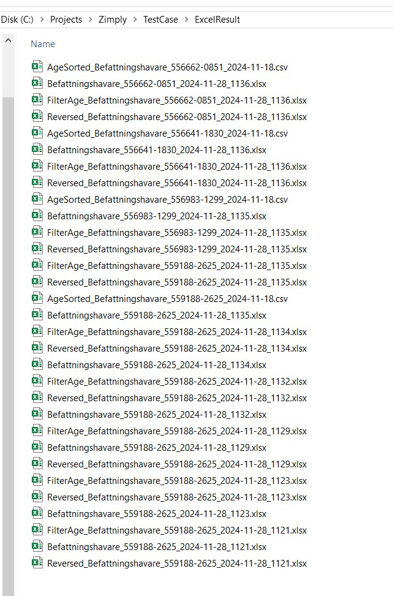
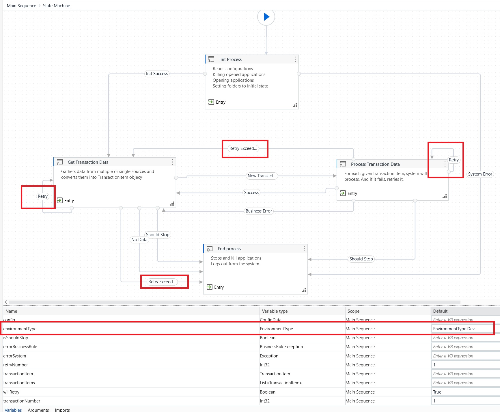

# Zimply

### Getting Started

Please copy the package within the *pack* folder into your local NuGet package folder. The only file you'll be needing is **UiPath.Plugin.Zimply.1.0.12.nupkg*
A video of the working version of the project can be found doc/videos/

### Assumptions
- The user has installed the latest Chrome version as a browser

### Notes
- Uses RE-Framework structure and we use a Producer-Consumer pattern
- No custom activity is used
- Config data and the transaction data are based on C# classes named "ConfigData" and "TransactionItem"

### Why I used a class
- When you use a strongly typed object rather than from a DataTable, it completely avoids getting an error during RUNTIME. The error will reveal itself during the BUILD
- Other developers will be less exposed to making unintended errors such as mistyping with the help of IntelliSense
- We can use JSON file in ConfigData and this is much easier to read and extend than a simple data table
- Configuration and Transaction Item properties can be easier to categorize as below
  - Api.Google.Url
  - Api.Visa.Pass
  - BankNetwork.Folder.Screenshot

### Folder structure
- **doc**: Contains some informative images
- **pack**: The custom NuGet packages are located
- **plugin**: Custom NuGet package's source code in C#
- **uipath**: The UiPath project that contains the automation

### Infrastructure

- Config environment can be changed within **Main.xaml** using **environment** variable
  - By default, it's **Dev**
  - Others are **Uat** and **Prod**
- The data is produced from given sources (e.g. email, file, database, etc,) in **Get Transaction Data** state and they are converted into one known object named **TransactionItem**
  - Has a retry mechanism in case of a failure
- Transaction Items will be processed one by one within **Process Transaction Data** state
  - Has a retry mechanism in case of an unknown failure
  - There could be business rule exceptions and since these are expected exceptions, they will not be retried
 
  
  

